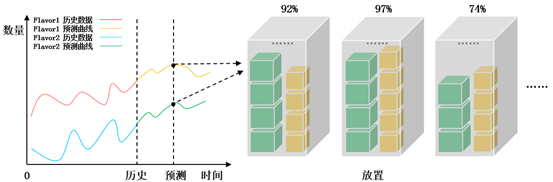
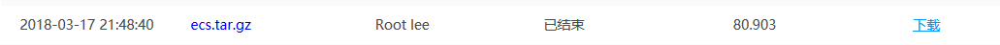
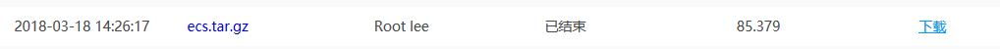
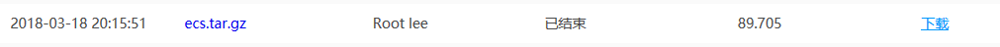
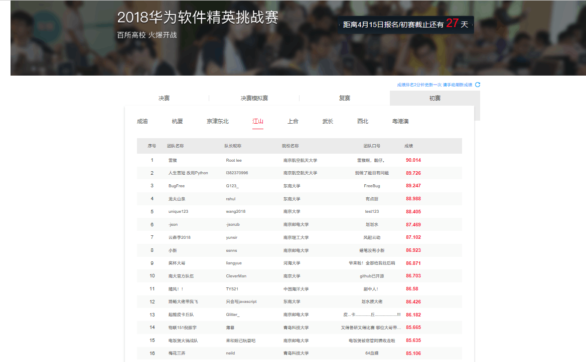
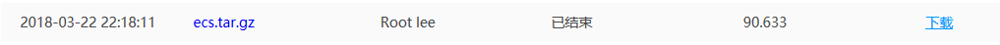
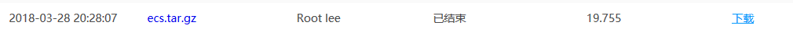

# 背景介绍

云平台为了满足不同租户的需求，提供了一种可随时自助获取、可弹性伸缩的云服务器，即弹性云服务器（Elastic Cloud Server，ECS）。为容纳更多的租户请求、并尽可能提高资源利用率、降低成本，自动化、智能化的资源调度管理系统非常关键。

由于租户对ECS实例（虚拟机，VM）请求的行为具有一定规律，可以通过对历史ECS实例请求的分析，预测到未来一段时间的ECS实例请求，然后对预测的请求分配资源（如图1所示），这样可以找到一个接近最优的分配策略，实现资源最大化利用，同时也能参考预测的结果制定云数据中心的建设计划。

赛题更加详细的信息请参考2018华为软件精英挑战赛官网（http://codecraft.devcloud.huaweicloud.com/home/detail）

# 代码介绍

比赛赛题主要可以分成两个步骤：

1. 根据历史虚拟机请求数量预测接下来几天的各类虚拟机请求数量（主要通过机器学习方法）
2. 将预测出来的虚拟机放置进规定规格的物理服务器中，使得物理服务器的资源（CPU或者内存）利用率最高

第一个步骤需要先对数据进行预处理，比如去除节假日期间的异常请求值等等，然后应用机器学习的方法使用历史数据训练预测模型，最后使用训练出来的预测模型进行预测，不知道是测试用例原因还是我们使用的模型的原因，这一步骤做出来效果并不是太好，所以这部分暂时就先不放出来了，以免误导大家。

第二个步骤是寻找最优放置虚拟机方式，在上一步预测出来各种虚拟机数量之后，实际资源使用情况就已经确定了（一共多少CPU，多少内存），每个服务器的资源又是确定的，所以最终的资源使用率就只跟服务器数量有关，于是问题便转化为了：如何放置虚拟机可以使得使用的服务器数量最少？

因为每次放置都要考虑虚拟机的CPU和内存两个维度，所以放置问题可以看作一个二维装箱问题（**Bin packing**），人们对二维装箱问题的研究一直在进行。

第一种最简单的方法（也是官方文档示例方法）是**首次适应法**（FF算法），即将所有的虚拟机按次序放入物理服务器中，对于每个虚拟机，检查服务器资源是否足够放下该虚拟机，如果可以放下就将其放在这台服务器上，如果服务器剩余资源不足以放下该虚拟机，则新建一台服务器，将虚拟机放入新建的服务器……直到最后放置完所有的虚拟机，将每个服务器放置的虚拟机输出即可。

首次适应方法有个弊端，可能会造成每个服务器都有挺多资源剩余，但是却无法被后来的虚拟机利用。由于在采用首次适应法的前提下，虚拟机放置方式只与虚拟机初始排列顺序有关，所以我们可以用智能算法对初始排列顺序进行优化，求得接近最优解的解。我们可以采用模拟退火算法进行最优解的寻找，**模拟退火算法**（Simulated Annealing Algorithm）用于优化问题的出发点是基于物理中固体物质的退火过程与一般优化问题的相似性，关于该算法的详细介绍，请参考维基百科（https://zh.wikipedia.org/wiki/%E6%A8%A1%E6%8B%9F%E9%80%80%E7%81%AB）。

使用模拟退火算法， 每次随机交换两个虚拟机的顺序，使用首次适应法将虚拟机放入服务器，并计算出服务器使用数目最少的一组，模拟退火算法收敛过后，我们即可得到一个最优解或者接近最优解的解，将其作为最终结果输出即可。

# 代码结构

代码主要包括三个文件：1. Server.h   2. Server.cpp   3.put_flavors_to_servers.cpp

其中，Server.h和Server.cpp 两个文件是Flavor结构体和Server类的声明与定义文件，Flavor结构体包括三个成员：name、cpu、mem，代表一个虚拟机基本的属性；Server类包括成员：总内存、总CPU、空闲内存、空闲CPU，方法：put_flavor (放置Flavor)、get_cpu_usage_rate(获取CPU使用率)、get_mem_usage_rate(获取内存使用率)；put_flavors_to_servers.cpp文件定义了put_flavors_to_servers函数，用于使用模拟退火算法找到最优放置虚拟机方式。main函数使用自己定义一些参数，用于演示函数的使用方法，仅供参考使用。

# 程序效果

1. 第一阶段，使用最简单的方法，预测采取直接取训练集后面7天的数据作为预测的7天结果，放置方法采取首次适应方法，即将虚拟机放进第一个能放进去的服务器，放不进去时就增加一个物理服务器。该方法最终得分80.903分，说实话这么高的分还是让我很惊讶的，所以也就有了后面继续进行优化的动力。

   

2. 第二阶段，使用暴力优化，即采用循环10000次的方法寻找其中最好的解，每次循环都随机打乱虚拟机放置的顺序，然后计算得分情况，保存资源利用率最高的一种方法，在这种方法下，虽然可以找到相对较好的解，但结果完全“随缘”，成绩提升到了85.379分：

   

3. 第三阶段，采用模拟退火算法+首次适用算法，起始温度设为100，终止温度设为1，温度下降速度设为0.9999，每次模拟退火循环都随机交换虚拟机序列中的两个虚拟机顺序，这样最后整个虚拟机序列会收敛到一个最优解或近似最优解，相比于第二阶段的暴力循环，成绩提升到了89.705分：

   

4. 第四阶段，方法还是使用模拟退火算法+首次适用方法，通过调整起始温度、终止温度、温度下降速度等参数，将分数进一步提高，达到了90.014，第一次达到90分以上，也占据了江山赛区的榜首位置。

   

5. 第五阶段，针对于每个测试用例进行调参进一步提高分数（*注意，这里存在对测试数据过拟合问题*），后来又提高了一点点分数，最终达到90.633分，成绩稳定保持在榜单前三名，后来感觉再继续调参已经没什么意义，便停止了程序继续更迭，准备等最后正式比赛再继续调整参数。

   

# 总结

这样调参可能存在对数据过拟合问题，我单独调参时发现满分20分的一个初级用例，我们算法的得分已经得到了19.755分，几乎达到了标准答案的程度，但是算法模型对后面正比赛的测试用例的效果还需等到正式比赛才能验证。

第一步骤中的预测部分，感觉还是找不到一个比较好的算法，加上最近忙于准备实习面试，没有太多精力继续“调参大战”，希望分享出来分配虚拟机部分代码可以帮助迷茫的同学们找到一点思路。如果您感觉这部分代码对您有一点帮助，希望您能不吝给这个项目一个Star，万分感谢！
